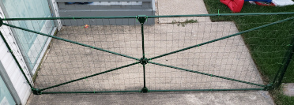
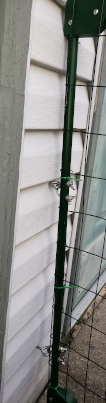

# ParametricGate
  
 
 
This is a parametric gate for a small fence.  
  
Given the height and width of the desired gate along with a few other parameters this will generate end and center pieces which can be used to form a gate from pipes. I made mine with 1/2" metal conduit pipes. The angles for the pipe holes are calculated so they will come together at the correct distances.  
  
This generates three kinds of pieces  
- Corner (print 4 of these)  
- Tees (for a middle, vertical support) (print 2)  
- Center (print 1)  
  
It also generates a test piece which can be used for getting the hole sizes just right before printing the hole thing.   The test piece also has two bolt holes which I used as a pattern for drilling holes to mount u-bolts on one side to act as a hinge.  

ToDo  
- Add comments to parameters for use with the customizer  
- Add some form of latch  
- Re-design the center piece*  
- Calculate exact pipe lenghts, print a picture with the lenghts of each pipe
  
I designed the center piece with holes that go all the way through. The idea was to run one of the diagonal pieces all the way across then cut the others at angles to meet it. Eyeballing the angles for these cuts proved to be difficult and it was a tough fit.  Instead in a future version I may have a polygon in the middle with the sides angled so that the pipes can be straight-cut.  
  
I may also add an option to omit the vertical support and/or one of the diagonal supports for smaller gates.  

